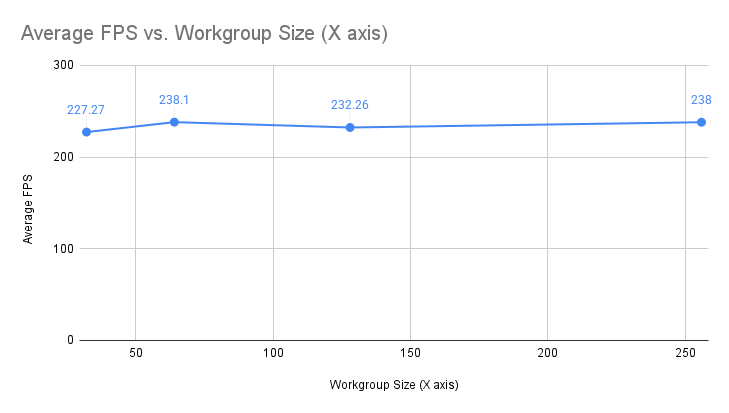

# Project5-WebGPU-Gaussian-Splat-Viewer

**University of Pennsylvania, CIS 565: GPU Programming and Architecture, Project 5**
* Anthony Ge
  * [LinkedIn](https://www.linkedin.com/in/anthonyge/), [personal website](https://www.geant.pro)
* Tested on: **Google Chrome 141.0**, i9-13900H @ 2600 Mhz 16GB, NVIDIA 
GeForce RTX 4070 Laptop GPU 8GB (personal)

### Live Demo

### Demo Video/GIF

### (Introduction)

For this project, I implemented 3D gaussian splat viewing in WebGPU. Gaussian Splatting is a novel real-time rendering technique for radiance fields, working by representing a given scene initially as a point cloud of 3D gaussians. Each gaussian is mathematically converted to a 2D splat via projection using a given gaussian's 3D to 2D covariance matrix. Its color is also determined by stored spherical harmonic coefficients. To render the splats, we use radix sort to re-order 2D splats by depth to render from back to front, since alpha-blending is order dependent, resulting in an overall volume-rendered like result.

Further details about the implementation can be found in the [3D Gaussian Splatting for Real-Time Radiance Field Rendering](https://repo-sam.inria.fr/fungraph/3d-gaussian-splatting/) from SIGGRAPH 2023, with reference code in CUDA at their [implementation repository (which I heavily referenced).](https://github.com/graphdeco-inria/gaussian-splattingA)

### Analysis
The first point cloud renderer is a drastically simplified visualization of our gaussian renderer. Rather than rendering 2D splats, the point cloud instead renders yellow points, giving a 3D representation of our initial scene without any special visual details besides providing an idea of the scene's shape. 

<table>
<tr>
<th>Point Cloud</th>
<th>Gaussian Splats</th>
</tr>
<tr>
<td></td>
<td></td>
</tr>
</table>

## Performance Testing
To analyze performance, I tested differences in performance based on workgroup-size, culling, and the number of gaussian splats in the scene.

For my workgroup test, I used the bonsai scene. As workgroup-size increased, I did not notice any sizable differences in performance for preprocess from 64 to 256. In addition, performance neared around my refresh rate (240hz), so I wasn't able to get too much useful information, but there is a general trend of better performance as workgroup size increases.

This can mostly be attributed to better compute throughput from an increase workgroup size. I'm not sure if cache coherency may be better, since we have an array of structs for storing gaussian data as opposed to arrays of data, but it's possible that there may be better cache use from having a larger workgroup size too.

A very simple test I did to test culling is by moving my camera backwards to completely avoid any splats, and I did this for the bike scene.

Culling did improve performance in certain instances when the camera doesn't view many gaussians at a time. This is simply because we reduce the number of elements to sort and instance render, effectively also reducing our workload and improving framerates.

<table>
<tr>
<th>No Culling Avg FPS (Bike)</th>
<th>Culling Avg FPS (Bike)</th>
</tr>
<tr>
<td>44 FPS</td>
<td>238.10 FPS</td>
</tr>
</table>

Performance was essentially the same (near 240 FPS) for both bonsai and the bike scene, and I ran out of allocated buffer memory for the large bike scene (I suppose maybe the 16 bit optimization is necessary or something).  Theoretically, though, the performance should worsen as our number of splats increase, as this would simply increase the number of elements to preprocess, sort, and instance render.

### Credits

- [Vite](https://vitejs.dev/)
- [tweakpane](https://tweakpane.github.io/docs//v3/monitor-bindings/)
- [stats.js](https://github.com/mrdoob/stats.js)
- [wgpu-matrix](https://github.com/greggman/wgpu-matrix)
- Special Thanks to: Shrek Shao (Google WebGPU team) & [Differential Guassian Renderer](https://github.com/graphdeco-inria/diff-gaussian-rasterization)
